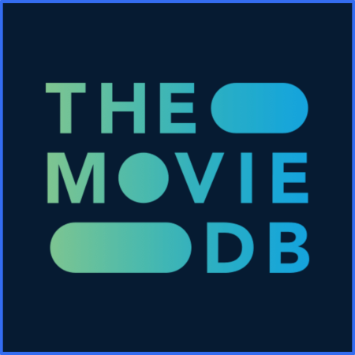

# Hello Compose Multiplatform

### App de exemplo do Compose Multplatform

Para instruções de como configurar o projeto em KMP por favor acesse o [link](https://medium.com/@joaomarcelo-ms/kotlin-multiplataform-compartilhando-c%C3%B3digo-entre-android-e-ios-87c809e34220)
- Padrão Clean
- Consumo de API the movies db
- Material3
- Voyager
- Libres
- Ktor-client
- Kotlinx-serialization
- Koin
- Compose-image-loader
- Build Config

Login
Usuário qualquer
Senha : abc123

Link para o [Artigo](https://joaomarcelo-ms.medium.com/hello-compose-multiplatform-15b91f0035dd)

Crie um usuário no [TMDB](https://developer.themoviedb.org/reference/movie-popular-list)
Logo após crie uma chave de api e copie ela e o token de acesso para autorizar na plataforma e coloque no código do projeto em gradle.properties

